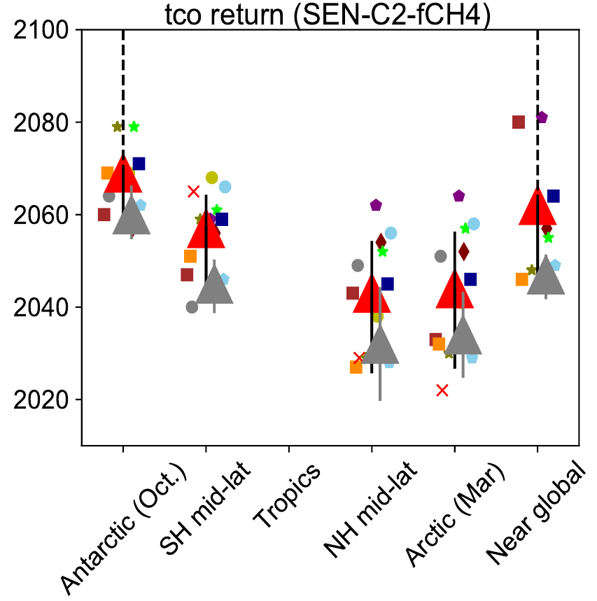

Total Column Ozone, Return years
===================================

   Estimated MMM1S return dates (red triangles) of total column ozone from 
   the SEN-C2-fCH4 simulations for different latitude bands.
   Credit: S.S. Dhomse et al., Supplement of Atmos. Chem. Phys., 18, 8409–8438, 2018

As mentioned in the previous section, the time series of total column
ozone (zonally averaged) can be normalized using satellite observations
of ozone data. Usually a year before the decline of ozone in the 1980s
is used for the normalization. If the year 1980 is taken, then we use
the measurements of the ozone column and move all the model time series
up or down so that they pass through the point of measurement. Since
ozone has been decreasing from that point and has slowly recovered and
is rising again, we are able to check when in the future ozone will be
at the same level as in 1980 again. Having done this we can plot the
time of ozone returning to 1980 level for each model and for different
seasons/months/latitude bands.

