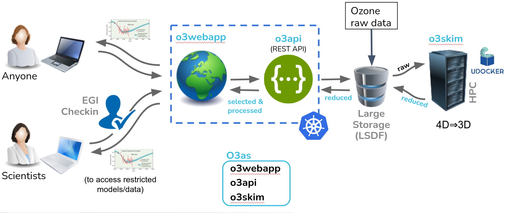

O3as Project
==============

Motivation
------------

Monitoring and projecting stratospheric ozone is mandated by UN Environment to 
**safeguard a healthy planet**. Regularly many climate models project 
future climate and ozone change, producing **huge amounts of data** that 
have to be analysed for **key metrics**. Those key metrics help policy makers to judge
if measures implemented to protect the stratospheric ozone layer are working.

Project goals
--------------

To provide a framework to efficiently explore ozone projections, including
the calculation of key metrics:

*  Improve the existing workflow and provide a **reliable tool** for scientists 
   to perform analysis in a **more efficient** manner
*  Ensure **reproducibility** of results
*  **Simplify data access** and the use
*  Publish high-level data to **citizens**

Problem to solve
------------------

*  A typical workflow of today has many **manual** steps
*  Full processing from raw data takes **hours**
*  The code is **not always accessible** or well **maintained**

| **Consequences**:
| => Plots are **not easy to rebuild** for various inputs
| => Possible **inconsistency** in results
| => **No-way to assess** the results by **non-specialists**

O3as solution
---------------

   
   O3as service general structure
   
*  Climate Models data (10's TB) are collected in **one place** (Large Scale Data Facility, `LSDF at KIT <https://www.scc.kit.edu/en/research/11843.php>`__)
*  The data are **reduced** to the parameters of interest and **homogenized** at HPC by the means of **o3skim** component
*  The reduced data (100's MB) can be accessed with the **REST API** in seconds (**o3api** component)
*  A user may do final processing and plotting by leveraging the **WebApp** (**o3webapp** *to come*)

All components are `open source <https://codebase.helmholtz.cloud/m-team/o3as>`__ (GPLv3), documented, implemented with continuous
integration and delivery (CI/CD) based on Jenkins (`JePL <https://indigo-dc.github.io/jenkins-pipeline-library>`__), and dockerised: o3skim is run
via `udocker <https://github.com/indigo-dc/udocker>`__ in HPC, o3api and o3webapp are in the cloud (Kubernetes cluster).